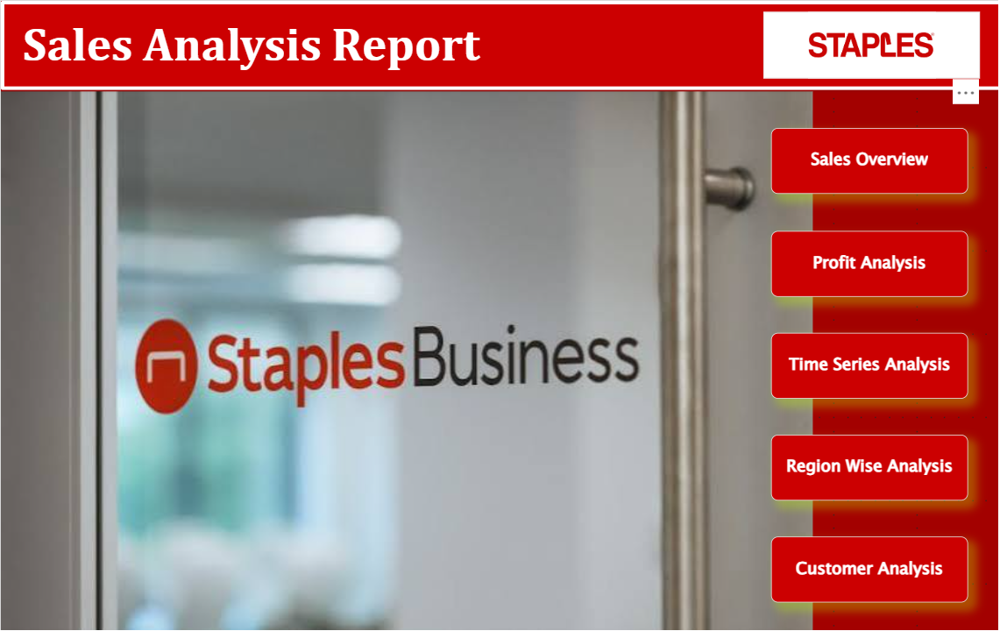
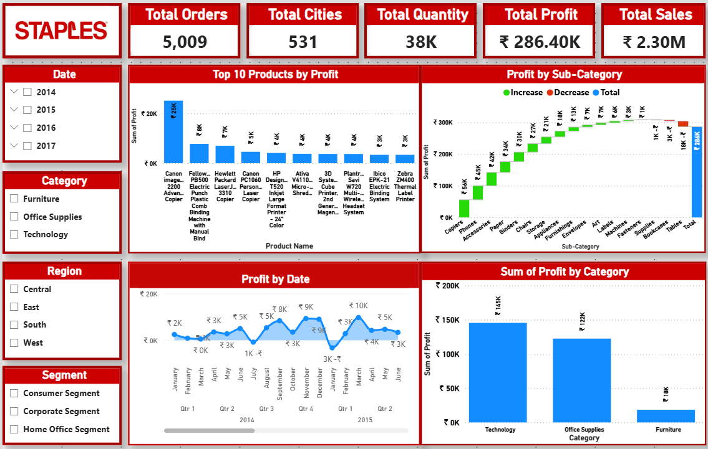
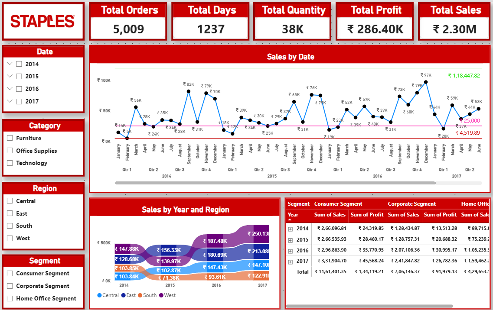
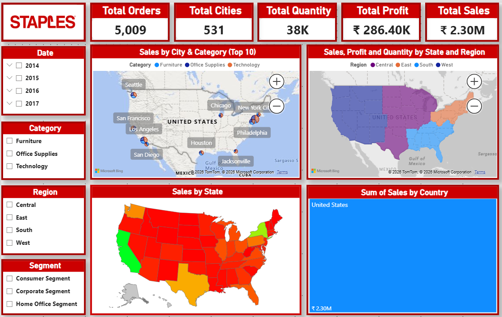
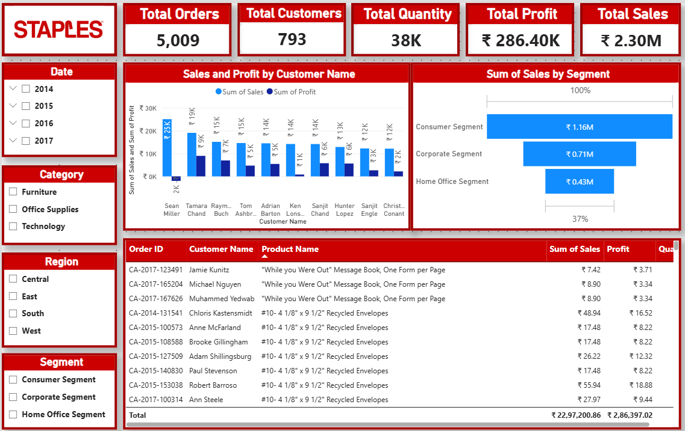

# Power BI Sales Analysis Dashboard

## 📊 Project Overview

This project is an interactive Power BI dashboard developed to analyze sales performance, profitability, customer segments, product performance, and regional trends.

The dashboard provides a consolidated view of business performance through interactive KPIs, charts, maps, slicers, and detailed tables.

> This is an independent portfolio project created for learning and demonstrating Power BI and data analytics skills. It is not affiliated with Staples.

---

## 🎯 Objectives

- Analyze overall sales and profit performance.
- Identify sales trends across different years.
- Analyze product and category profitability.
- Compare sales performance across regions and states.
- Understand customer and segment performance.
- Present business information through interactive visualizations.

---

## 🛠️ Tools & Technologies

- **Microsoft Power BI**
- Data Visualization
- Business Intelligence
- Data Analysis
- Interactive Dashboards
- Slicers and Filters
- KPI Analysis

---

## 📌 Dashboard Sections

### 1. Home

The landing page provides navigation to the major analytical sections of the dashboard:

- Sales Overview
- Profit Analysis
- Time Series Analysis
- Region-Wise Analysis
- Customer Analysis

### 2. Sales Overview

The Sales Overview page provides a high-level view of business performance using:

- Total Orders
- Total Cities
- Total Quantity
- Total Profit
- Total Sales
- Sales by Region and Category
- Profit by Category
- Sales and Profit by Year
- Sales by City and Category

### 3. Profit Analysis

The Profit Analysis page focuses on profitability and includes:

- Top 10 Products by Profit
- Profit by Sub-Category
- Profit by Date
- Profit by Category

### 4. Time Series Analysis

The Time Series Analysis page examines sales performance over time using:

- Sales by Date
- Year-wise sales trends
- Year and region-wise sales analysis
- Segment-wise sales and profit analysis

### 5. Region-Wise Analysis

The Region-Wise Analysis page provides geographical insights using:

- Sales by City and Category
- Sales, Profit and Quantity by State and Region
- Sales by State
- Country-level sales analysis
- Interactive geographical maps

### 6. Customer Analysis

The Customer Analysis page provides insights into:

- Sales and Profit by Customer
- Sales by Customer Segment
- Customer-level order information
- Product and customer details
- Sales and profit comparison across segments

---

## 📈 Key Performance Indicators

| KPI | Value |
|---|---:|
| Total Orders | 5,009 |
| Total Customers | 793 |
| Total Cities | 531 |
| Total Quantity | 38K |
| Total Sales | ₹2.30M |
| Total Profit | ₹286.40K |

---

## 📊 Power BI Features Used

- KPI Cards
- Bar Charts
- Column Charts
- Line Charts
- Waterfall Chart
- Funnel Chart
- Geographic Maps
- Tables
- Slicers
- Interactive Filters
- Drill-down Analysis
- Time Series Analysis
- Segment Analysis

---

## 🔍 Business Areas Covered

- Sales Performance
- Profitability Analysis
- Product Performance
- Category Analysis
- Regional Analysis
- Customer Analysis
- Segment Analysis
- Time-Based Analysis

---

## 🖼️ Dashboard Screenshots

### Home

### Sales Overview

### Profit Analysis

### Time Series Analysis

### Region-Wise Analysis

### Customer Analysis

---

## 📁 Project Files

- `welcome.pbix` — Power BI project file
- `screenshots/` — Dashboard screenshots

---

## 💼 Skills Demonstrated

- Power BI Dashboard Development
- Data Visualization
- Business Data Analysis
- KPI Development
- Interactive Reporting
- Trend Analysis
- Customer & Segment Analysis
- Regional Analysis
- Business Intelligence
